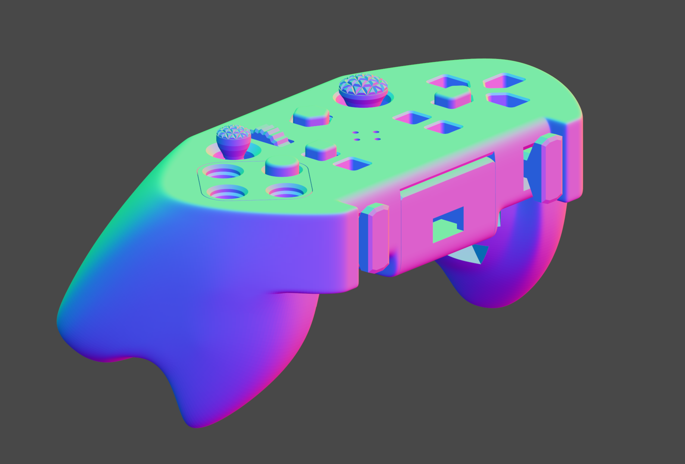
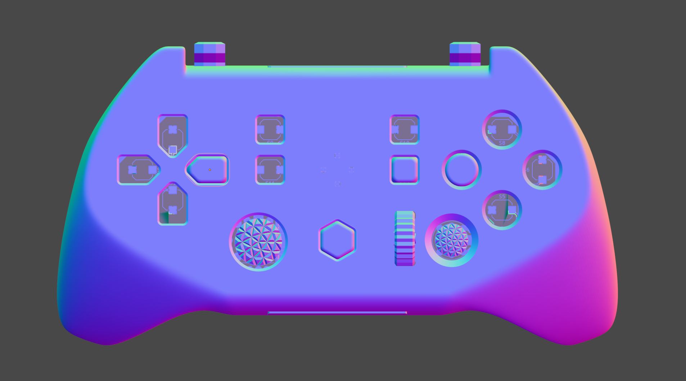
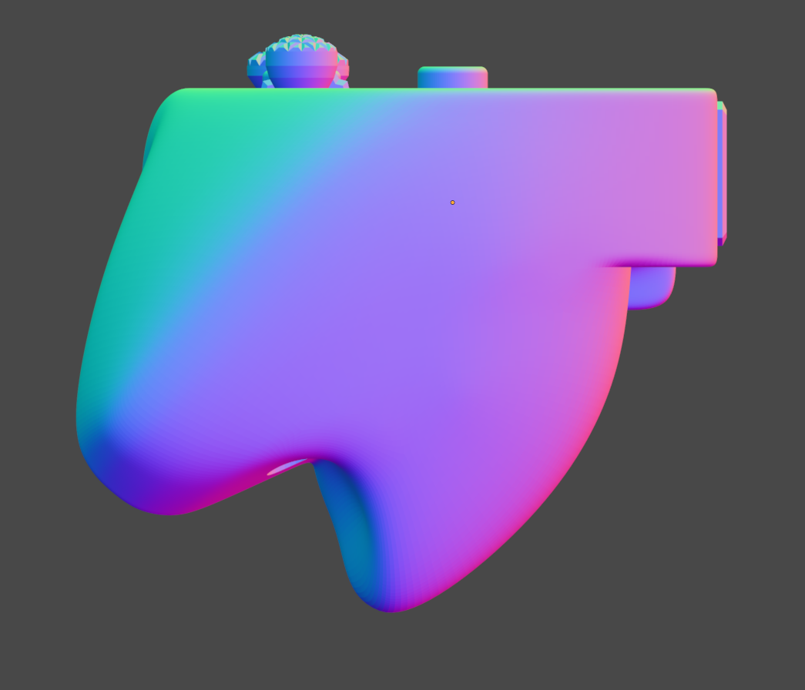
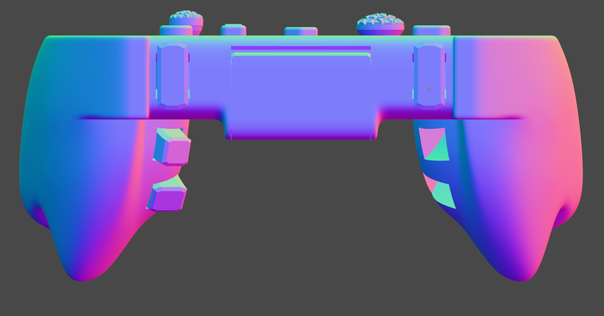
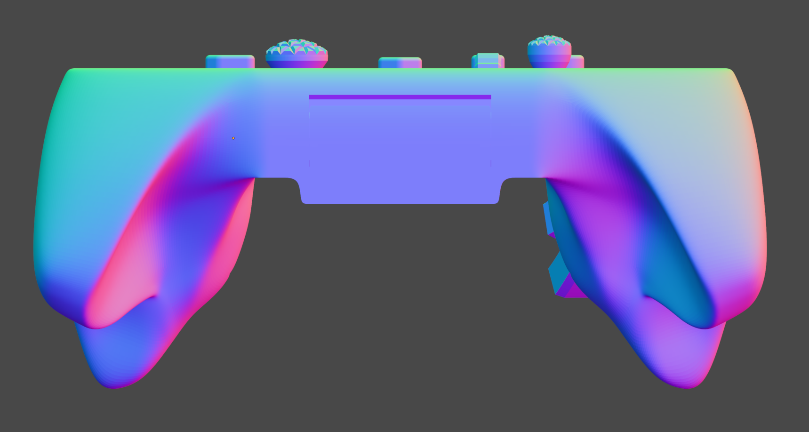
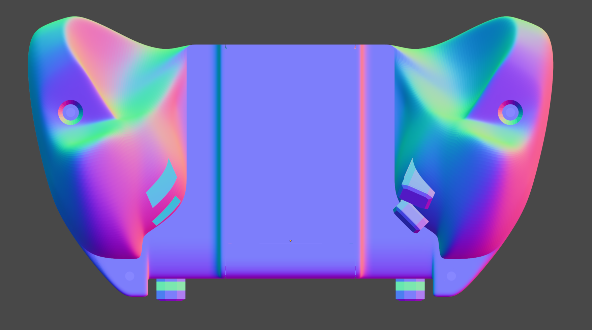

# GRIPR1

Complete case for Alpakka 1.0 controller

READ CAVEATS: 
this mod due to know issue with gyro and clicky tac buttons exhibit cursor jumping on L1 R1 press. So, Im looking for solutions but no easy fix yet. I personally modded my PCB and replaced stock switches to silent ones to solve this issue. 

Theres a branch with vanilla style alpakka switches so you can use that instead.
Those switches require tuning so everyone who is willing to collaborate and print so i can have feedback is welcomed.

Grip designed to improve grip for gyro.

Costumizable and procedural in Blender geometry nodes.

Mod is made in blender like original case extensively using geometry nodes for customization.

WHAT IS CUSTOMIZABLE:

Thumbsticks: shape, range, length, etc.
Front Buttons: shape, tolerances, stopper positions, smd button heights, size,bevels etc.
R1L1: shape, tolerances, stoppers etc.
R2R4 L2L4: size, tolerances, positions 
The case itself: customizable manually, no geometry nodes involved yet, tough might be used for certain features.

*Customizable I mean that you can change certain aspects like button tolerance or height through changing certain parameters in blender. Basically moving sliders.

3D PRINTING. 
Repo goes with orca slicer project with all best settings and orientations for buttons. 0.2 mm layerheight is default,  you can use 0.1 no problem, everything in between like 0.15 is not recommended to avoid tolerance issues. 
You can use any layerheight though, the only thing is that you might want to adjust tolerances and certain dimensions for those layerheights to avoid precision issues due to layer dimension rounding. 

STL EXPORT and blender project structure:
If you want to make some customizations, you need to open .blend for required part like "buttons" or "trigger_R2-R4", make changes and then save that file. 
You can export then directly from that file if you changed only buttons geometry, otherwise If you change some parameters that affect case shape, you should also export updated "case_front" or "case_back".
Its really easy to get lost exporting every sine change that so what I recommend is to BATCH EXPORT from main assembly file called "gripr1".
That way tou can make changes to multiple parameters in different parts and then export everything at once. 
Open "gripr1.blend", go to export to stl and select "batch" in top right corner of export window. Then in filename just delete everyting before .stl and press export and it will export each object using its name as separate stl. That way you can be sure that  all your stl files are changed. Then in orca slicer you can press on each object and press "reload from disk" and it will reload updated  files. Though last step might not work if orca writes paths to stls as absolute locations (we should check this out). (edited)Thursday, December 25, 2025 8:20 AM

Ok.
That is currently condensed guide for anyone willing to try

Oleroma 
Millwod 

## Project links
- [Alpakka Manual](https://inputlabs.io/devices/alpakka/manual). _(only original, not for this mod)_
- [Alpakka Firmware](https://github.com/inputlabs/alpakka_firmware).
- [Alpakka PCB](https://github.com/inputlabs/alpakka_pcb).
- [Alpakka 3D-print](https://github.com/inputlabs/alpakka_case). _(original case)_
- [Input Labs Roadmap](https://github.com/orgs/inputlabs/projects/2/views/2).

## Previews

 *(Previews might be outdated)*

## Dependencies
- Git LFS.
- Blender >= 4.x.

## LFS and file download
If you only want to download the Blender and STL files `DO NOT USE download ZIP` GitHub button, since it is not compatible with LFS (Large File Storage), but instead clone the repo.

To use Git with this project it is required to install Git [Large File Storage](https://git-lfs.github.com).
